<div align="center">

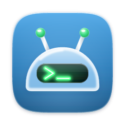

# SysDroid

**面向 Android 系统开发与调试的 Windows 桌面工具箱**

*An Android system development toolbox for Windows — ADB, props, settings, APKs, processes and scrcpy in one window.*

[](https://github.com/cschengliang/SysDroid-Win/actions/workflows/build.yml)
[](LICENSE)


-41CD52?logo=qt&logoColor=white)

</div>

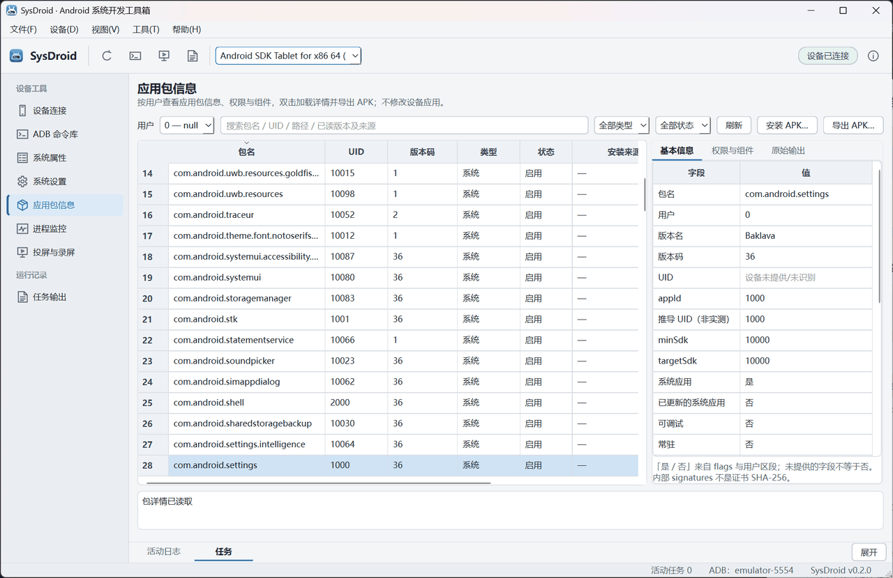

SysDroid 把日常 Android 系统开发中反复敲的 ADB 命令做成了一个原生 Windows 程序：连接设备、查看与修改系统属性和 Settings、管理 APK、监控进程、启动 Scrcpy 投屏录屏，所有操作都执行真实命令，输出与退出码随时可查。便携版自带 ADB、Scrcpy 5.0 和 Windows Terminal，解压即用。

## 功能

**设备连接**
- 实时跟踪设备插拔与状态变化，顶部全局设备选择器在各页面间同步
- 设备卡片：型号、Android 版本、电量、分辨率、ABI、SELinux、IP、构建指纹及 Root / Remount / Debuggable 状态（一次 `adb shell` 批量读取）
- 无线调试：IP 直连、配对码配对（`adb pair`）、mDNS 发现设备（`adb mdns services`）
- Root、Remount、重启到系统 / Recovery / Bootloader（均需确认）；一键在内置 Windows Terminal 中打开 `adb shell`

**ADB 命令库**
- 参数化命令模板（`{变量}`）与 PowerShell 命令预览，支持分类、收藏、执行类型筛选
- 自动填入上次使用的参数；无参数的简单命令可“直接执行”
- 工作流：把多条命令串成步骤顺序执行，任一步失败即停止
- 命令与工作流导入 / 导出 JSON，执行历史可回看输出

**系统属性**
- `getprop` 全量列表，按名称 / 值搜索、按 `ro.*` / `persist.*` 前缀筛选
- `setprop` 写入前确认、写入后读回校验
- 快照对比：记录或加载基线，列出新增 / 删除 / 变化的属性并导出 CSV

**系统设置**
- 按 Android 用户读取 `system` / `secure` / `global` 的全部名称与值
- 新增、修改、删除前确认，提交后逐项读回核对
- 常用预设：动画缩放、显示触摸操作、指针位置、充电时保持唤醒

**应用包信息**
- 按用户列出包名、UID、版本、系统 / 第三方、启用状态与安装来源；双击查看版本、SDK、权限、组件和 APK 路径
- 安装 APK：多选或拖放，支持 split（`install-multiple`），实时显示进度，可取消
- 启动、强行停止、启用 / 禁用、卸载，导出 APK（base + split）

**进程监控**
- 按 1–10 秒间隔采样 CPU%、RSS、VSS、Swap、线程数、运行时长等，列可自选
- 进程详情：完整 cmdline、PSS / SwapPss、ActivityManager 启动记录
- 结束进程（SIGTERM / SIGKILL）或强行停止应用，发送前复核 PID 防止误杀复用进程

**投屏与录屏**
- 自带 Scrcpy 5.0，以独立窗口投屏；画质预设、视频 / 音频编码与码率、键鼠控制、窗口选项
- 录制 MP4 / MKV，文件名自动带设备 Serial 与时间戳
- Scrcpy 5.0 选项：摄像头画面、新建虚拟显示屏、指定显示屏、裁剪、启动应用、关闭屏幕、保持唤醒、显示触摸点、UHID 键盘
- 每台设备一个会话，多台设备可同时投屏；配置自动保存

**任务输出与通用体验**
- 所有命令流式显示 stdout / stderr，保留真实状态、耗时与退出码，可停止、强制结束、查找、保存
- 表格统一交互：右键菜单、`Ctrl+C` 复制行、导出 CSV、`F5` 刷新、`Ctrl+F` 搜索
- 浅色 / 深色 / 跟随系统主题，Windows 11 原生样式

## 截图

| | |
| :---: | :---: |
| 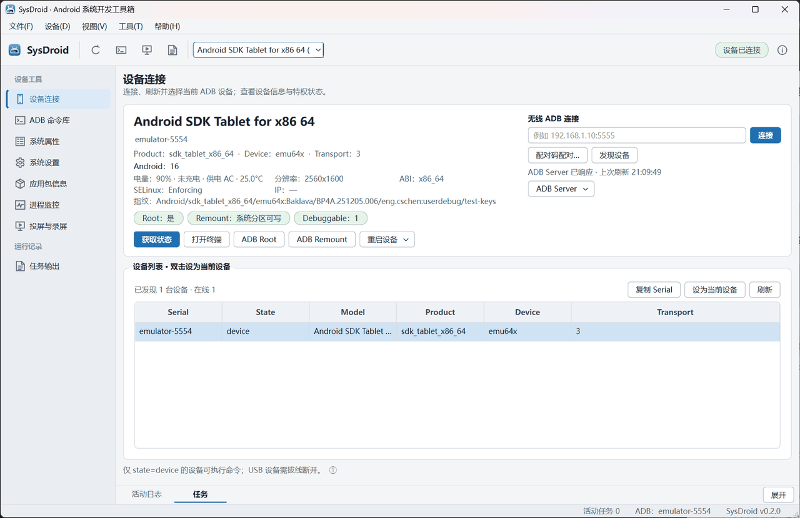<br>设备连接 | 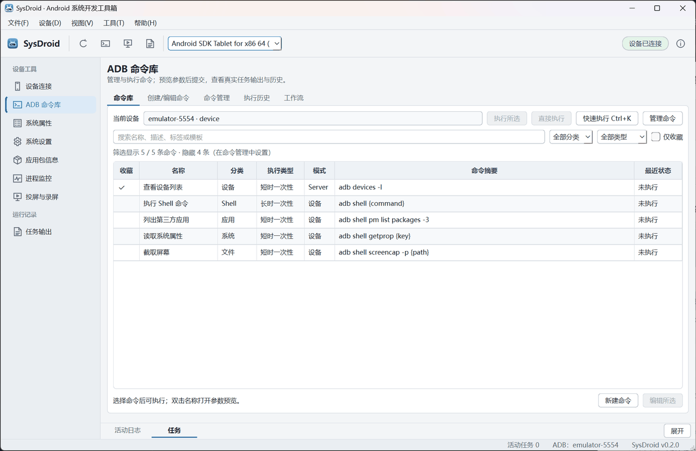<br>ADB 命令库 |
| 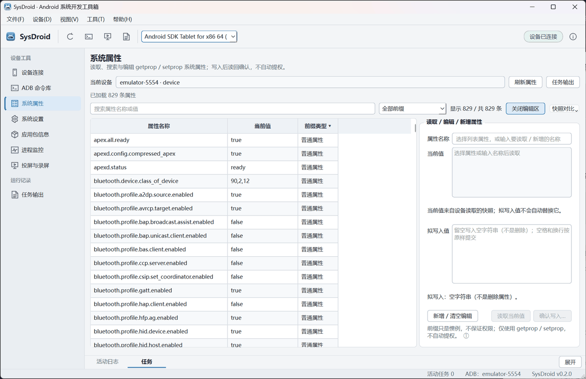<br>系统属性 | 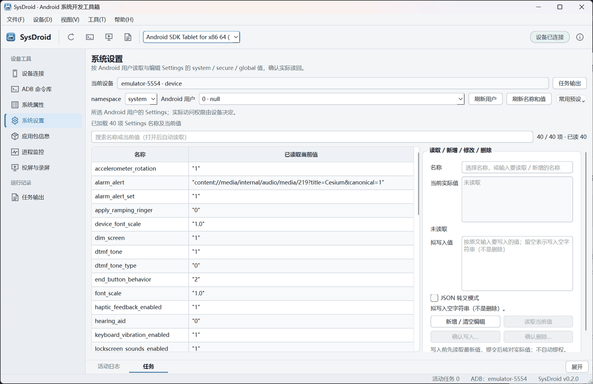<br>系统设置 |
| <br>应用包信息 | 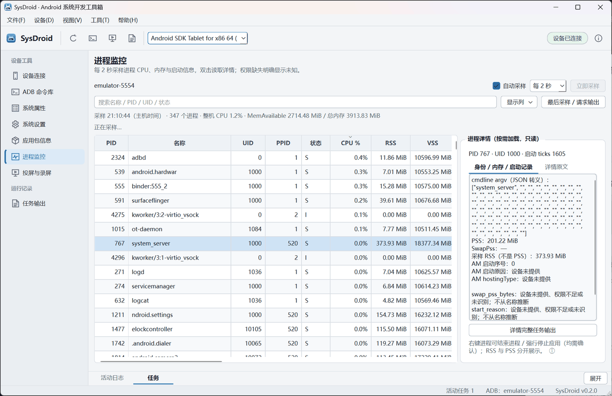<br>进程监控 |
| 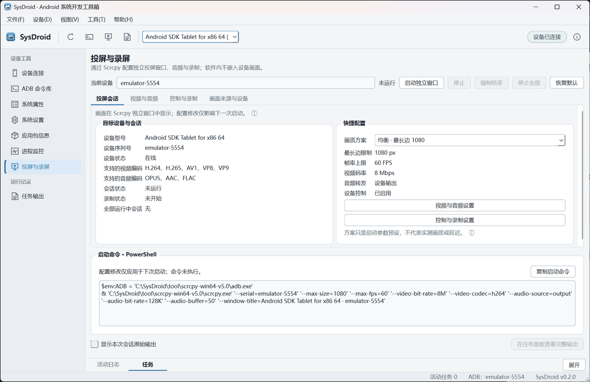<br>投屏与录屏 | 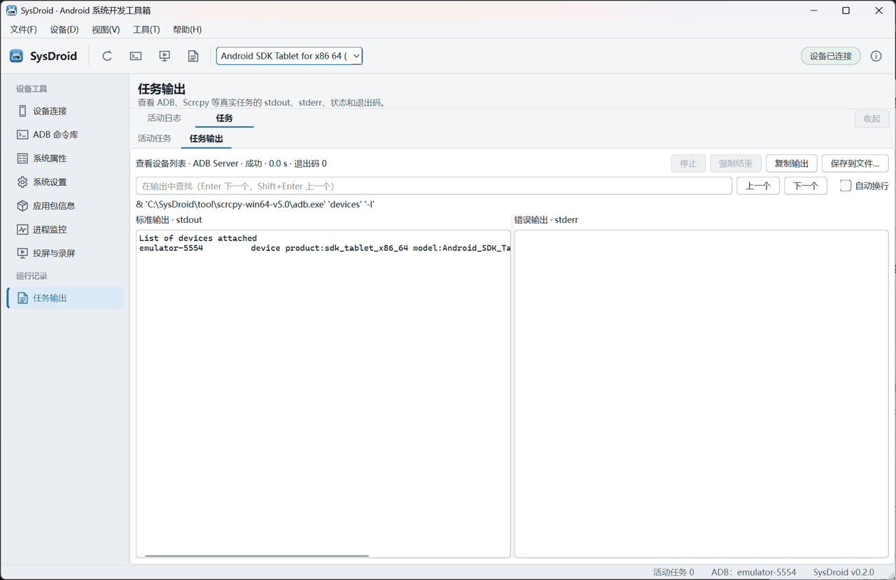<br>任务输出 |
| 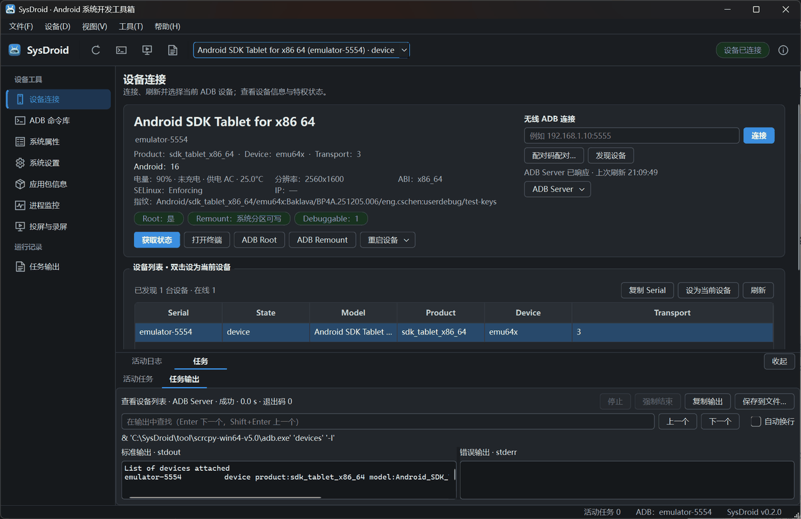<br>深色主题 · 设备连接 | 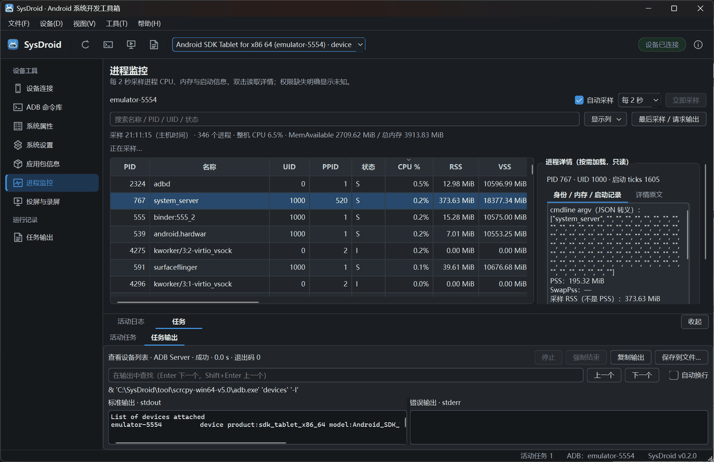<br>深色主题 · 进程监控 |

截图使用 Android 16 SDK 平板模拟器拍摄。

## 下载与使用

1. 从 [Releases](https://github.com/cschengliang/SysDroid-Win/releases) 下载最新的 `SysDroid-win-x64-<版本>.zip`；想试用未发布的版本，可在 [Actions](https://github.com/cschengliang/SysDroid-Win/actions/workflows/build.yml) 的构建记录中下载 Artifact。
2. 解压到任意目录（路径可含中文和空格），双击 `SysDroid.exe`。请保留完整目录，不要只复制 EXE 或删除 `_internal`、`tool`、`licenses`。
3. 在手机或平板上开启“开发者选项 → USB 调试”（无线调试需 Android 11+），用 USB 连接后在设备上允许调试授权。

- 不需要安装 Python、Qt、ADB 或 Scrcpy。面向 Windows 10 / 11 x64（主要在 Windows 11 上测试）；USB 驱动需自行安装。
- 用户数据（命令库、历史、Scrcpy 配置、窗口布局）保存在 `%LOCALAPPDATA%\SysDroid`，可用环境变量 `SYSDROID_DATA_DIR` 改到其他目录。从旧版升级时，首次启动会把 `%LOCALAPPDATA%\AndroidToolbox` 中的数据复制过来，旧目录保持不变。

## 从源码运行 / 构建

`lib/`（嵌入式 Python 3.14.8）和 `tool/`（Scrcpy、Windows Terminal）不在 git 中，克隆后请先按 [DEPENDENCIES.md](DEPENDENCIES.md) 补齐。

```bat
:: 安装依赖
lib\python-3.14.8-embed-amd64\python.exe -m pip install -r requirements.txt

:: 运行（或直接双击 start_sysdroid.bat）
lib\python-3.14.8-embed-amd64\python.exe -s sysdroid.py

:: 测试
lib\python-3.14.8-embed-amd64\python.exe -s -m pytest tests -q

:: 构建便携版 → dist\SysDroid-win-x64\ 与 .zip
lib\python-3.14.8-embed-amd64\python.exe -s scripts\build_sysdroid.py
```

GitHub Actions 的 [Build portable](.github/workflows/build.yml) 工作流可手动触发构建 Artifact；在网页上发布 Release（任意标签名）或推送 `v*` 标签时，自动构建并把 zip 与 sha256 上传到对应的 Release。实现细节、各页面的行为约定与构建审计见 [开发说明](docs/development.md)。

## 项目结构

```text
sysdroid.py / start_sysdroid.bat   # 源码启动器
SysDroid.spec                      # PyInstaller 配置（EXE 图标与版本信息）
assets/                            # 应用图标（.ico、多尺寸 PNG 及生成源文件）
src/sysdroid/
├─ app.py                          # 程序入口：QApplication、主题、主窗口
├─ core/                           # 无界面的设备逻辑：任务执行、设备、命令库、属性、Settings、APK、进程
└─ ui/                             # 主窗口、主题、通用控件与表格、任务面板
   └─ pages/                       # 每个导航页一个模块
scripts/                           # 便携版构建与第三方资源
docs/                              # 开发说明、设计文档、截图
tests/                             # core / ui / packaging 测试
```

## 许可证

SysDroid 以 [Apache License 2.0](LICENSE) 开源。

便携版随附以下第三方组件，许可证与源码获取方式见发行包内的 `licenses/` 和 `THIRD-PARTY-NOTICES.txt`：

- [scrcpy](https://github.com/Genymobile/scrcpy) 5.0（含 ADB）— Apache-2.0
- [Windows Terminal](https://github.com/microsoft/terminal) — MIT
- [Qt](https://www.qt.io/) / [PySide6](https://doc.qt.io/qtforpython-6/) — LGPL-3.0，以可替换的动态链接库形式分发
